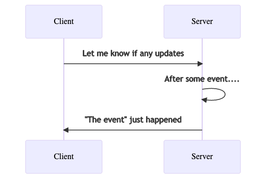

# Socket.io in python

- 16 January 2022

Socket.IO has been in my list of things to learn from a very long time, so i was very excited to experiment with it.

I started out using the instructions for [installation](https://python-socketio.readthedocs.io/en/latest/client.html#installation) and used the [example](https://python-socketio.readthedocs.io/en/latest/intro.html) to understand what is happening here.

Basically this is what happens:

However it is interesting to dig a bit deeper and see what actually makes this work. So after reading up articles and alse looking at the developer tools in chrome and firefox, Socket.IO uses a HTTP octet stream to initiate a long term poll request and then passes the baton on to other technologies, webRTC, AJAX to do the actual exchange of data. have a look at this [link](https://github.com/pfertyk/webrtc-working-example), it uses Socket.IO to start the connection, and handoffs to webRTC, which is slightly confusing if you have no idea about webRTC, but still a lovely example of using Socket.IO to do the handshake and then use webRTC to transmit the data.

What situations is socketIO good for, though?

1. you use Socket.IO in situations where you need to transmit only a little data and you dont want to continuously poll the server. - like to inform the client that there is more data or that that report that the user started creating an hour back is finally complete and ready to download.
2. you need the data as soon as it is created - like in a chat. or to know of the position of the other user as soon as it changes, like in a map.

And why should you not use Socket.IO ?

Not for regular web programming - you have GET, POST, PUT, DELETE - which are wonderful, completely supported to use for web development.

There are also a few overheads to using socketIO. Socket.IO creates a long term connection between client and server. Apart from this, the 80+kb the javascript file size might be concerning.

I would really like to go through the https://github.com/pfertyk/webrtc-working-example link, if only to understand more about Socket.IO, but a small study in webRTC is on the cards. Till next week, ciao!

[https://python-socketio.readthedocs.io/en/latest/client.html](https://python-socketio.readthedocs.io/en/latest/client.html)

[https://itnext.io/differences-between-websockets-and-socket-io-a9e5fa29d3dc](https://itnext.io/differences-between-websockets-and-socket-io-a9e5fa29d3dc)

[https://ably.com/topic/socketio](https://ably.com/topic/socketio)
